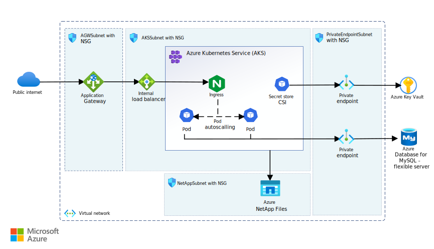

# Wordpress on Azure Kubernetes Service

## Overview
This project provides a comprehensive deployment of a WordPress application on Azure Kubernetes Service (AKS), leveraging Azure-native services to build a secure and scalable environment. The solution is designed to demonstrate how containerized workloads like WordPress can be deployed and managed effectively in a cloud-native architecture using Infrastructure-as-Code and Kubernetes best practices.

The deployment includes the creation of a fully configured AKS cluster, the integration with Azure Key Vault for secure secret management using the CSI driver, and the use of Azure NetApp Files as a high-performance NFS-based storage backend for persistent volumes. The application is exposed internally within the virtual network through an NGINX Ingress Controller, configured to work behind an Azure Application Gateway for controlled ingress traffic and potential integration with WAF or TLS termination.

All infrastructure components are defined using Bicep templates, allowing for consistent, repeatable deployments across environments. The repository also includes a set of Kubernetes manifest files used to deploy the Wordpress workload.


## Architecture
The architecture of this project is designed to deploy WordPress on Azure Kubernetes Service (AKS) in a secure, high-performance, and modular environment, leveraging native Azure services and Kubernetes extensibility.

The solution consists of an AKS cluster hosting the WordPress application, a private ingress path exposed through an internal NGINX Ingress Controller, and an Azure Application Gateway serving as the external entry point to the environment. Secrets are securely pulled at runtime from Azure Key Vault using the CSI driver, and persistent storage is provided by Azure NetApp Files, offering superior I/O performance required by WordPress. The backend database is hosted on Azure Database for MySQL.


*Download the [architecture.vsdx](./architecture.vsdx) file of the architecture*

### Azure Kubernetes Service (AKS)
The AKS cluster is deployed with Azure CNI Overlay, which enables Kubernetes pods to receive IPs from a private overlay address space, decoupled from the virtual network subnet. This model simplifies IP management and reduces subnet exhaustion risks, especially in large or dynamic environments.
The NGINX Ingress Controller is deployed using the App Routing add-on, which simplifies the integration of ingress traffic management within AKS clusters.
For more details on the App Routing add-on refer to the official documentation ([Managed NGINX ingress with the application routing add-on](https://learn.microsoft.com/en-us/azure/aks/app-routing)).

### Azure Key Vault + CSI Driver
This architecture integrates Azure Key Vault through the CSI Secrets Store Driver, to avoid storing application secrets as base64-encoded Kubernetes Secret objects. This allows secrets (such as database credentials or application keys) to be securely pulled from Key Vault at runtime and mounted as volumes in the WordPress pod, without ever persisting them in the cluster. This significantly reduces the attack surface and enforces centralized secret governance.

### Azure Application Gateway
The Application Gateway acts as the primary ingress point to the AKS cluster. It is configured to forward traffic to the internal IP of the NGINX Ingress Controller running inside the cluster. The Application Gateway supports native integration with Web Application Firewall (WAF), TLS termination, and URL-based routing, making it a flexible and secure solution for production environments (not deployed in this case).

### Azure NetApp Files
For persistent volume claims, this architecture uses Azure NetApp Files with NFS. Compared to Azure Files, NetApp provides much higher throughput and lower latency, which is critical for workloads like WordPress that perform numerous I/O operations, including frequent reads and writes to the file system for themes, plugins, media uploads, and configuration changes. Additionally, Azure NetApp Files allows throughput to scale with the volume size, enabling performance tuning based on workload requirements. This choice ensures better responsiveness and stability under load. ([Service levels for Azure NetApp Files](https://learn.microsoft.com/en-us/azure/azure-netapp-files/azure-netapp-files-service-levels)).

### Azure Database for MySQL
The database layer is managed using Azure Database for MySQL – Flexible Server, a fully managed relational database service that provides built-in high availability, automated backups, and scaling capabilities. It serves as the backend for WordPress without requiring further configuration inside the Kubernetes environment.

### Private Endpoint
To improve network security and compliance, this architecture uses Private Endpoints for all key Azure PaaS services. Private Endpoints assign private IPs within the Virtual Network, ensuring all traffic to Key Vault, NetApp Files, MySQL, and Application Gateway stays on the Azure backbone. This prevents exposure to the public internet, reducing the attack surface, and restricts access to authorized VNet subnets only. This setup provides strong isolation and aligns with enterprise security best practices

## Infrastructure Deployment
The entire infrastructure for this project can be deployed easily using the Deploy to Azure button below. This triggers the deployment of all required Azure resources, including the AKS cluster, Key Vault, NetApp Files, MySQL database, and Application Gateway, fully configured and ready for the application workload.

[](https://portal.azure.com/#create/Microsoft.Template/uri/https%3A%2F%2Fraw.githubusercontent.com%2FTommaso23%2FWordpress-on-AKS%2Frefs%2Fheads%2Fmain%2Fazuredeploy.json)

## Kubernetes Deployment
The Kubernetes resources for the WordPress application are deployed in a structured and automated way using the provided Bash script. All workload components, including persistent volume claims, deployments, and services, are deployed within a dedicated namespace called wordpress to ensure isolation and manageability.

The NGINX Ingress Controller and its related resources are deployed separately in their own dedicated namespace to isolate ingress traffic management from the application workload.

The deployment order respects resource dependencies and includes the following manifest files:

- `namespace.yaml` (creates the wordpress namespace)

- `pv-wp.yaml` (persistent volumes using Azure NetApp Files)

- `pvc-wp.yaml` (persistent volume claims)

- `nginx-internal-controller.yaml` (NGINX ingress controller in its own namespace)

- `nginx.yaml` (NGINX ingress resource)

- `secretprovider.yaml` (secrets injected via Azure Key Vault CSI driver)

- `deployment-wp.yaml` (WordPress deployment)

- `service-wp.yaml` (WordPress service)

The script handles connecting to the AKS cluster, retrieving necessary parameters, and applying the manifests in the correct sequence, ensuring a smooth and repeatable deployment process.

### Clone the Repository
Start by cloning the repository:
```bash
git clone https://github.com/Tommaso23/Wordpress-on-AKS.git
```
### Prerequisites
Ensure the following tools are installed and accessible in your environment:
- Azure CLI
- kubectl
- bash (Linux/macOS/WSL or Git Bash on Windows)

Before running the script, make sure to:

1 Log in to your Azure account:
```bash
az login
```
2 Set the correct subscription and tenant context
```bash
az account set --subscription "<your-subscription-id>"
```
You can verify the current context with:
```bash
az account show
```
Once everything is set, you can proceed to run the deployment script, which you can find at [k8s/deploy.sh](../k8s/deploy.sh)

>⚠️ Before running it, make sure to edit the script and set your AKS resource group and cluster name at the top.

## Future Improvements
The following points highlight potential enhancements to increase security, performance, and manageability of the current architecture:
- Deploy a Web Application Firewall (WAF) and enable end-to-end HTTPS communication for improved security.

- Integrate Azure Container Registry (ACR) to store and manage container images in a more controlled and secure way.

- Apply Network Security Groups (NSGs) with granular rules to better define the network perimeter and restrict traffic.

- Add Azure Cache for Redis to improve WordPress performance by caching frequently accessed data.

## Additional Resources
Below are useful links for further reference and deeper insights into the services used in this project:
- [WordPress on Azure Kubernetes Service](https://learn.microsoft.com/en-us/azure/architecture/example-scenario/infrastructure/wordpress-container)

- [What is Azure NetApp Files?](https://learn.microsoft.com/en-us/azure/azure-netapp-files/azure-netapp-files-introduction)

- [Use the Azure Key Vault provider for Secrets Store CSI Driver in an Azure Kubernetes Service (AKS) cluster](https://learn.microsoft.com/en-us/azure/aks/csi-secrets-store-driver)

- [Azure Container Networking Interface (CNI) Overlay networking](https://learn.microsoft.com/en-us/azure/aks/concepts-network-azure-cni-overlay)

- [WordPress on Azure](https://learn.microsoft.com/it-it/azure/architecture/guide/infrastructure/wordpress-overview)

- [What is Azure Database for MySQL - Flexible Server?](https://learn.microsoft.com/en-us/azure/mysql/flexible-server/overview)
