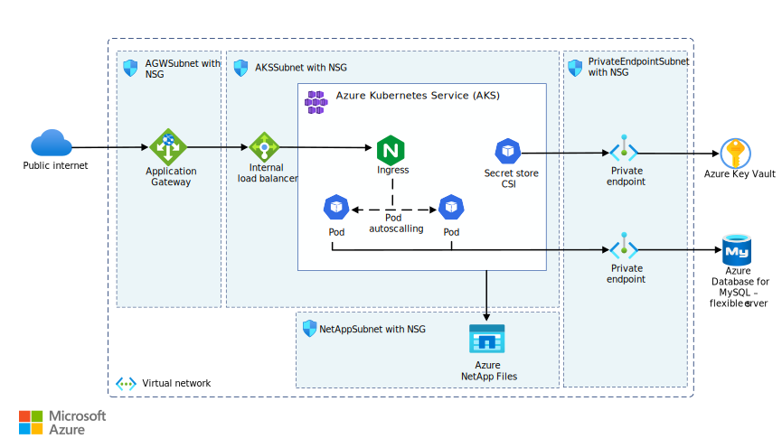

# Wordpress on Azure Kubernetes Service
This repo contains the initial setup required to...

*Download the [architecture.vsdx](./architecture.vsdx) file of the architecture*

## 1: Deploy
### Prerequisites
### Deployment

The az aks get-credentials command will be fetch a kubeconfig containing references to the AKS cluster you have created earlier.

minimum kubectl version: 1.30.x